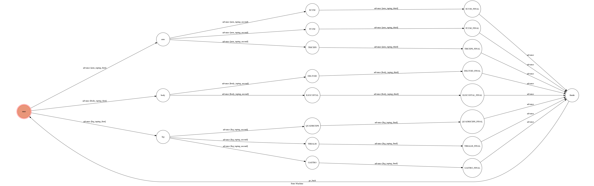

# Tape Tutorial Chatbot


A [Facebook messenger bot](https://www.facebook.com/%E8%B2%BC%E7%B4%AE%E6%A9%9F%E5%99%A8%E4%BA%BA-296561760877487/) based on a finite state machine

Tape Tutorial can help you find useful videos in Youtube 

## Finite State Machine


## Usage
The initial state is set to `start`.

Every time `start` state is triggered `check` to check whether it can go to other states or stay at the original state.

* start
	* Input: 任何訊息（會將input做自然語言處理）
		* 如果沒有找到部位的資料：
		    * Reply: "請描述你想要貼紮的部位~ 你可以考慮選擇熱門搜尋：" ＋ 3個快速回覆的按鈕
		    * 停留在`start` state
		* 如果找到部位資料：(可以決定要自行輸入或是按快速回覆的按鈕)
			* Reply: 
			    1. 回傳該部位的肌肉剖面圖
				2. "請選擇要貼紮的部位：" ＋ 3個快速回覆的按鈕
			* 移動到`arm`、`body`或`leg` state
* arm
	* Input: 快速回覆的其中一個按鈕(伸腕肌/屈腕肌/三頭肌)
		* Reply: "是否要觀看(伸腕肌/屈腕肌/三頭肌)的貼紮教學影片？" ＋ 2個快速回覆的按鈕
		* 移動到`arm_muscle` state

* body
	* Input: 快速回覆的其中一個按鈕(三角肌/豎脊肌)		
	    * Reply: "是否要觀看(三角肌/豎脊肌)的貼紮教學影片？" ＋ 2個快速回覆的按鈕
		* 移動到`body_muscle` state

* leg
	* Input: 快速回覆的其中一個按鈕(股四頭肌/脛前肌/腓腸肌)
		* Reply: "是否要觀看(股四頭肌/脛前肌/腓腸肌)的貼紮教學影片？" ＋ 2個快速回覆的按鈕
		* 移動到`leg_muscle` state

* arm_muscle
	* Input: 快速回覆的其中一個按鈕(我要觀看/選擇其他部位)
		* If input: 我要觀看
		    * Reply: 
		        1. "以下是(伸腕肌/屈腕肌/三頭肌)的教學影片："
		        2. youtube網址
		        3. "按下面按鈕以繼續"
		        4. 快速按鈕"看其他影片"
            * 移動到`finish` state
		* If input: 選擇其他部位
		    * Reply: "請描述你想要貼紮的部位~ 你可以考慮選擇熱門搜尋：" ＋ 3個快速回覆的按鈕
		    * 移動到`start` state

* body_muscle
	* Input: 快速回覆的其中一個按鈕(我要觀看/選擇其他部位)
		* If input: 我要觀看
		    * Reply: 
		        1. "以下是(三角肌/豎脊肌)的教學影片："
		        2. youtube網址
		        3. "按下面按鈕以繼續"
		        4. 快速按鈕"看其他影片"
            * 移動到`finish` state
		* If input: 選擇其他部位
		    * Reply: "請描述你想要貼紮的部位~ 你可以考慮選擇熱門搜尋：" ＋ 3個快速回覆的按鈕
		    * 移動到`start` state

* leg_muscle
	* Input: 快速回覆的其中一個按鈕(我要觀看/選擇其他部位)
		* If input: 我要觀看
		    * Reply: 
		        1. "以下是(股四頭肌/脛前肌/腓腸肌)的教學影片："
		        2. youtube網址
		        3. "按下面按鈕以繼續"
		        4. 快速按鈕"看其他影片"
            * 移動到`finish` state
		* If input: 選擇其他部位
		    * Reply: "請描述你想要貼紮的部位~ 你可以考慮選擇熱門搜尋：" ＋ 3個快速回覆的按鈕
		    * 移動到`start` state

* finish
	* Input: 快速回覆"看其他影片"或是任意訊息
        * Reply: "請描述你想要貼紮的部位~ 你可以考慮選擇熱門搜尋：" ＋ 3個快速回覆的按鈕
		* 移動到`start` state

## Feature
1. ```import re``` to get HTML element information from the URL
    * 熱門搜尋的資料來源 
2. Use ```jieba``` to segment sentences and get the extract tags.
    * 使用者輸入的訊息會經過斷詞處理
    * 將爬蟲後結果用jieba取出關鍵詞
3. Send the image to let users know where the muscle is.
4. Use [quick-reply](https://developers.facebook.com/docs/messenger-platform/send-messages/quick-replies/) to clarify what users can reply without typing.
5. Use [GCP](https://cloud.google.com/) to deploy the chatbot.

## Setup
### Prerequisite
* Python 3
* Facebook Page and App
* HTTPS Server

#### Install Dependency
```sh
pip3 install -r requirements.txt
```

* pygraphviz (For visualizing Finite State Machine)
    * [Setup pygraphviz on Ubuntu](http://www.jianshu.com/p/a3da7ecc5303)

## Reference
[TOC-Project-2019](https://github.com/winonecheng/TOC-Project-2019)
