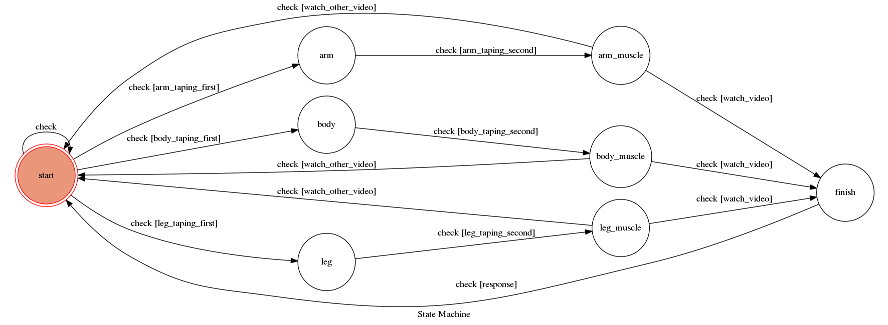

# Tape Tutorial Chatbot

A Facebook messenger bot based on a finite state machine

Tape Tutorial can help you find useful videos in Youtube 

## Setup

### Prerequisite
* Python 3
* Facebook Page and App
* HTTPS Server

#### Install Dependency
```sh
pip3 install -r requirements.txt
```

* pygraphviz (For visualizing Finite State Machine)
    * [Setup pygraphviz on Ubuntu](http://www.jianshu.com/p/a3da7ecc5303)

## Finite State Machine


## Usage
The initial state is set to `start`.

Every time `start` state is triggered `check` to check whether it can go to other states or stay at the original state.

* start
	* Input: 想要貼紮的部位
		* Reply: "請描述你想要貼紮的部位~ 你可以考慮選擇熱門搜尋："

	* Input: "go to state2"
		* Reply: "I'm entering state2"


## Reference
[TOC-Project-2017](https://github.com/Lee-W/TOC-Project-2017) ❤️ [@Lee-W](https://github.com/Lee-W)
